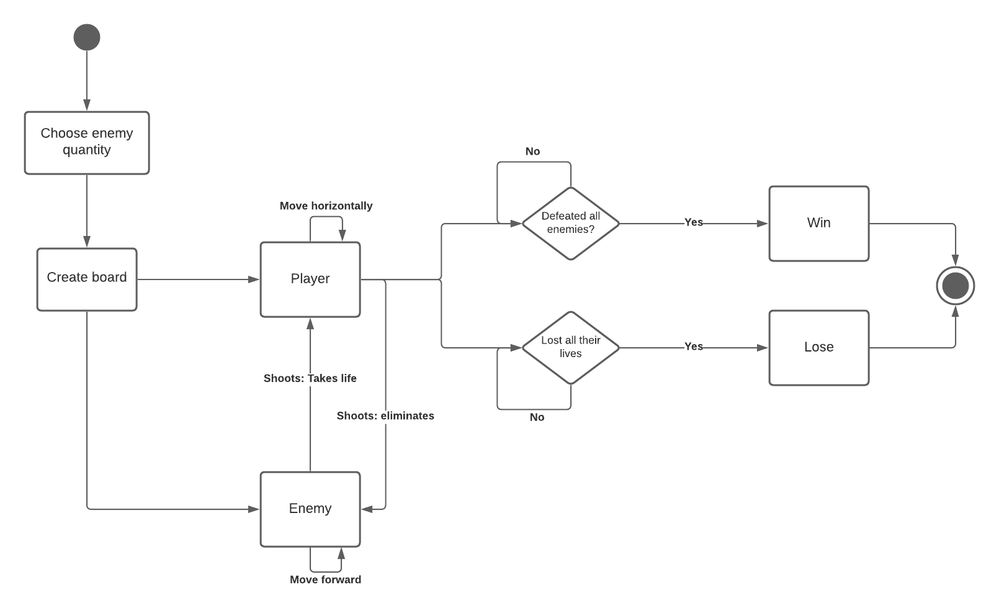

# Space Invaders in C

The game consists in the implementation of the classic game space invaders using the multithreading C library [pthread](https://man7.org/linux/man-pages/man7/pthreads.7.html),
each of the enemies is being created within a thread that implements the behaviour of movement and shooting, the player can shoot and move via keyboard input.

## Notable Components

`RUNNING: int` We use this variable to start the game and chain each of the following methods.

`drawUI: void` Used to create the UI to show the lives and score of the player.

`initBoard: void` Used to create the instances of the enemies using threads and fill the array for the representation of the board.

`drawBoard: void` Used to translate the data structures into human understandable interface.

`playerMonitor: void` This function purpose is to create the instance of a the player, its movement and also creates other threads to represent the bullets.
 
`playerBulletThread: void` Implements the behaviour of the player bullet.
 
`enemyBehaviour: void` This function purpose is to create an instance of an enemy, give random movement and random shooting intervals, the bullets are created in other threads. 

`enemyBulletThread: void` Implements the behaviour of an enemy bullet.

## Process diagram

## Activity diagram

